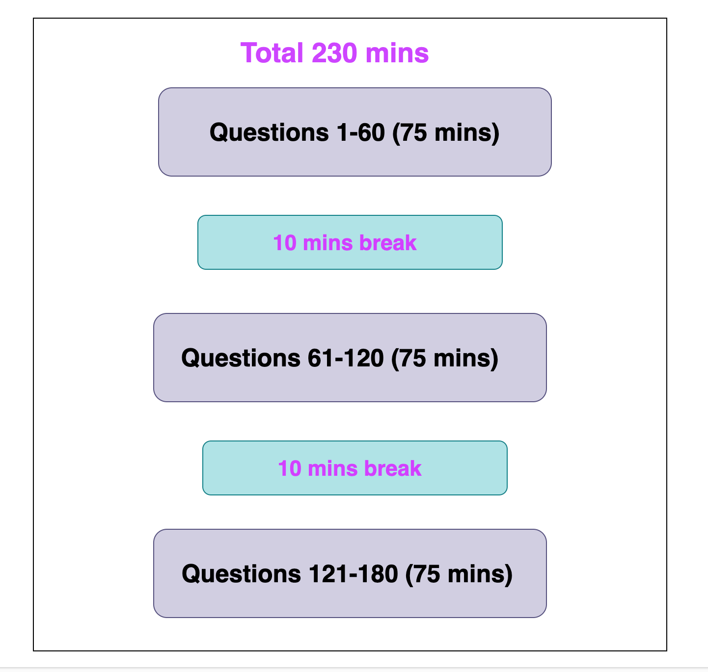

# PMP Certification

## Overview
The Project Management Professional (PMP) certification is a globally recognized credential for project managers. It demonstrates that you have the experience, education, and competency to lead and direct projects.

## Requirements
- A four-year degree
- 36 months of project management experience
- 35 hours of project management education/training or CAPM® Certification

## Exam Details
- **Format:** Multiple-choice
- **Number of Questions:** 200
- **Duration:** 4 hours
- **Domains Covered:**
    - Initiating
    - Planning
    - Executing
    - Monitoring and Controlling
    - Closing

## Study Tips
1. **Understand the PMBOK Guide:** The PMP exam is based on the Project Management Body of Knowledge (PMBOK) Guide.
2. **Take Practice Exams:** Familiarize yourself with the exam format and types of questions.
3. **Join Study Groups:** Collaborate with others who are also preparing for the exam.
4. **Use PMP Prep Books:** There are many books available that provide comprehensive coverage of the exam material.

## Time Management on the PMP Exam

Effective time management is crucial when taking the PMP exam. Here are some tips to help you manage your time wisely:

1. **Practice Time Management:** During your preparation, take timed practice exams to get used to the pace you need to maintain.
2. **Read Questions Carefully:** Take the time to read each question thoroughly before answering. Misreading a question can lead to mistakes.
3. **Pace Yourself:** Aim to spend about 1 minute per question. This will leave you with extra time to review your answers.
4. **Flag Difficult Questions:** If you encounter a challenging question, flag it and move on. Return to it after you have answered the easier questions.
5. **Take Breaks:** The PMP exam allows for scheduled breaks. Use these breaks to rest and recharge.

Total 230 minutes, not including breaks, 75secs per question 

## Resources
- [PMI Official Website](https://www.pmi.org/)
- [PMBOK Guide](https://www.pmi.org/pmbok-guide-standards/foundational/pmbok)
- [PMP Exam Prep Books](https://www.pmi.org/certifications/project-management-pmp/earn-the-pmp/pmp-exam-preparation)

# The course outline
1. PMI PMP exam details [Details](/PMI-PMP-Exam-details.md)
2. Project Management Terms [Details](/project-management-terms.md)
3. Project Management Principle [Details](/project-management-principle.md)
