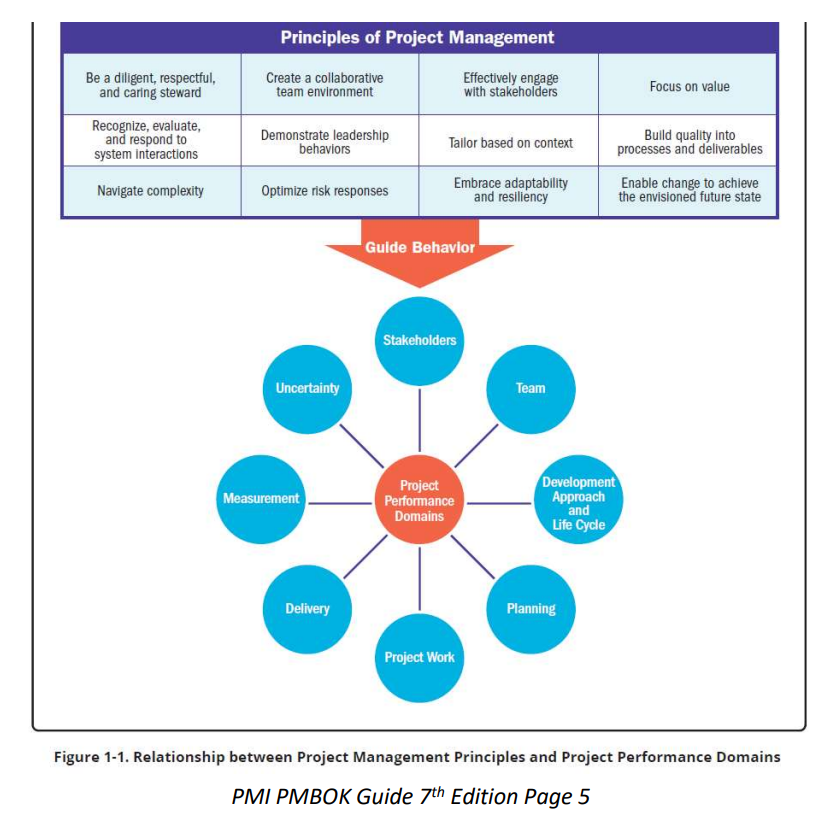
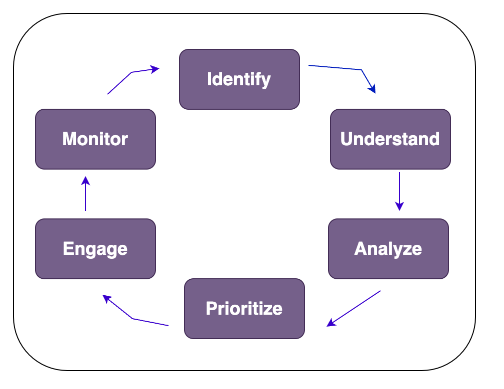

# Project Management Domain

### Principles and Performance Domain 
- Domains are a group of related activities that are critical for the effective delivery of project outcomes. 
- Thery are interactive, interrelated, and interdependent areas of focus that work in unison to achieve desired project outcomes. 
- They operate as an integrated system, with each domain being interdependent of the other domains to enable successful delivery of the project and its intended outcomes. 
- The specific activities undertaken within each of the performance domains are determined by the context of the organization, the project, deliverables, the project team, stakeholders, and other factors. 



### Stakeholder Performance Domain
- Addresses activities and functions associated with stakeholders.
- A productive working relationship with stakeholders throughout the project. 
- Stakeholder agreement with project objectives.
- Stakeholders who are project beneficiaries are supportive and satisfied while stakeholders who may oppose the project or its deliverables do not negatively impact project outcomes. 
- Defining and sharing a clear vision at the start of the project can enable good relationships and alignment throughout the project.

### Effective Stakeholder Engagement

- **Identify:** Identification is done throughout the project to understand who your stakeholders are, both internal and external. 
- **Understand and Analyze:** The project manager and the project team should seek to understand stakeholders feelings, emotions, beliefs, and values. 
- **Prioritize:** Focus on stakeholders with the most power and interest as one way to prioritize engagement. 
- **Engage:** Entails working collaboratively with stakeholders to introduce the project, elicit their requirements, manage expectations, resolve issues, negotiate, prioritize, problem solve and make decisions. 
- **Monitor:** Throughout the project, stakeholders will change as new stakeholders are identified and others cease to be stakeholders. 

### Stakeholder Performance Domain

<table>
  <thead style="background-color:blue">
    <tr>
      <th>Outcome</th>
      <th>Check</th>
    </tr>
  </thead>
  <tbody>
    <tr style="background-color:#3498db">
      <td>A productive working relationship with stakeholders throughout the project.</td>
      <td>Productive working relationships with stakeholders can be observed.</td>
    </tr>
    <tr style="background-color:#6495ED">
      <td>Stakeholder agreement with project objectives</td>
      <td>A significant number of changes or modifications to the project and product requirements in addition to the scope may indicate stakeholders are not engaged or aligned with project objectives.</td>
    </tr>
    <tr style="background-color:#6495ED">
      <td>Stakeholders who are project recipients are supportive and satisfied; stakeholders who may oppose the project or its deliverables do not negatively impact project results</td>
      <td>Stakeholder behavior can indicate whether project recipients are satisfied and supportive of the project or whether they oppose it. Surveys, interviews, and focus groups.
      A review of the project issue register and risk register can identify challenges associated with individual stakeholders. 
      </td>
    </tr>
  </tbody>
</table>

### Team Performance Domain
- Deals with activities and functions associated with the people who are responsible for creating project deliverables that realize business outcomes.
- Outcomes includes:
   - Shared ownership 
   - A high-performing team 
   - Appropriate leadership and other interpersonal skills
- This performance domain entails establishing the culture and environment that enables a collection of diverse individuals to evolve into a high-performing project team. 
- Terms used in this domain made of:
  - **Project Manager:** Assign by the business to lead the team and is responsible for accomplishing the project objectives.
  - **Project Management Team:** People who are directly involved in project management activities. 
  - **Project Team:** A group of individuals performing the work of the project to achieve its purposes. 

**Management Activities includes:**
- **Meeting Project Objectives,**
  - Effective processes, planning, coordinating, measuring, and monitoring work, among others. 
- **Leadership activities includes:**
  - Influencing 
  - Motivating 
  - Listening 
  - Enabling 
- **Leadership can be centralized and distributed**
  - **Centralized:** Accountability(being answereable for an outcome), is usually assigned to one individual,
  - **Distributed:** Shared among a project management team, and project team members.  

### Servant Leadership
- Servant leadership is a method of leadership that is based on the understanding and addressing the needs and development of project team members. 
- Servant leaders place emphasis on developing project team by focusing on addressing questions, such as:
  - Are project team members growing as individuals? 
  - Are project team members becoming healthier, wiser, freer and more autonomous? 
  - Are project team members more likely to become servant leaders? 
- Servant leadership behaviors include:
   - Obstacle removal 
   - Diversion shield 
   - Encourgement and development opportunities. 

### Common Aspects of Team Development 
- **Vision and objectives:** Everyone is aware of the project vision and objectives.
- **Roles and Responsibilities:** The members understand and fulfill their roles and responsibilities. 
- **Project team operations:** Facilitating project team communication, problem solving, and the process of coming to consensus. 
- **Guidance:** Ensure everyone is headed in the right direction. 
- **Growth:** Indentifying where the project team is carrying out well and pointing out areas where the project team can improve. 

### Project Team Culture:
- Each project team develops its own team culture. 
- The project manager is important is establishing and maintaining a safe, respectful, nonjudgemental environment that allows the project team to communicate openly. 
- This is accomplish this is by modeling behaviors such as:
   - Transparency
   - Integrity 
   - Respect 
   - Positive discourse
   - Support 
   - Courage 
   - Celebrating success 

### High Performing project teams 
Here are number of factors that contribute to high-performing project teams:
- Open communication 
- Shared understanding 
- Shared ownership 
- Trust 
- Collaboration 
- Adaptability 
- Resilience 
- Empowerment 
- Recognition 

- Leadership skills are valuable for all project team members whether the project team is operating. This includes:
  - Establishing and Maintaining Vision 
  - Critical Thinking 
  - Motivation 
  - Interpersonal Skills: Emotional intelligence. Being able to be self-aware, self-manage and have social awareness and social skills.
  - Decision making
  - Conflict management 
- Leadership methods are also tailored to meet the needs of the project, the environment, and the stakeholders. This can depend on:
  - Experience with the type of project 
  - Maturity of the project team members. 
  - Organizational governance structures 
  - Distributed project teams. 

<table>
  <thead style="background-color:blue">
    <tr>
      <th>Outcome</th>
      <th>Check</th>
    </tr>
  </thead>
  <tbody>
    <tr style="background-color:#3498db">
      <td>Shared ownership</td>
      <td>All team members know the vision and objectives.</td>
    </tr>
    <tr style="background-color:#6495ED">
      <td>A high-performing team</td>
      <td>The team trusts each other and collaborates. The team adapts to changing situations and is resilient in the face of challenges. The project team feels empowered and enpowers</td>
    </tr>
    <tr style="background-color:#6495ED">
      <td>Appropriate leadership and other interpersonal skills are demonstrated by all team members.</td>
      <td>Team members apply critical thinking and interpersonal skills. Team members leadership styles are appropriate to the project context and environment. 
      </td>
    </tr>
  </tbody>
</table>

### Development Approach and Life Cycle Performance Domain
- Deals with activities and functions associated with the development approach, cadence and life cycle phases of the project. 
- Delivery cadence refers to the timing and frequency of the project deliverables. 
- Outcomes includes:
  - Correct development approaches.
  - A project life cycle that connect the delivery of business and stakeholder value from the begining to the end of the project. 
  - A project life cycle consisting of phases that facilitate the delivery cadence and development approach required to produce the project deliverables. 
- Project can have a single delivery, multiple deliveries or periodic deliveries. 
- A development approach is the means used to create and evolve the product, service, or result during the project life cycle. 
- There are different development approaches. Three common approaches includes: 
  - Predictive approach
  - Adaptive approach, including both iterative and incremental.
  - Hybrid approach. 

**There are several factors that influence the selection of a development approach.**
- **Product, Service or result**
  - Degree of innovation 
  - Requirements certainty 
  - Scope stability 
  - Ease of change
  - Delivery options 
  - Risk 
  - Safety requirements 
  - Regulations 
- **The Project**
  - Stakeholders 
  - Schedule constraints 
  - Funding availability 
- **Organization**
  - Organizational structure
  - Culture 
  - Organizational capability 
  - Project team size and location 

**The type and number of project phases in a project life cycle rest on upon many things..**
```markdown
Feasibility ➡ Design ➡ Build ➡ Test ➡ Deploy ➡ Close 
```
<table>
  <thead style="background-color:blue">
    <tr>
      <th>Outcome</th>
      <th>Check</th>
    </tr>
  </thead>
  <tbody>
    <tr style="background-color:#3498db">
      <td>Deployment approaches are reliable with project deliverables</td>
      <td>The deployment approach for deliverables (Predictive, Hybrid, Adaptive) reflects the product variables and is suitable for the project and the organization.</td>
    </tr>
    <tr style="background-color:#6495ED">
      <td>A Project life cycle enatailing phases that connect the business and stakeholders to value from the beginning to the end of the project.</td>
      <td>Project work from start to end is represented in the project phases.</td>
    </tr>
    <tr style="background-color:#3498db">
      <td>Project life cycle phases that facilitate the delivery cadence and development approach required to create the deliverable.</td>
      <td>The cadence for development, testing, and deploying is represented in the life cycle phases.</td>
    </tr>
  </tbody>
</table>

### Planning performance domain
- Deals with activities and functions associated with the initial, ongoing, and evolving organization and coordination necessary for delivering project deliverables and outcomes. 
- The purpose of planning is to proactively develop an approach to create the project deliverables.
- **Outcomes includes:**
  - The project moves in an organized, coordinated, and deliberate mannar. 
  - There is a holistic approach to providing the project outcomes. 
  - Evolving information is elaborated. 
  - Time spent planning is appropritate. 
  - Planning is sufficient to manage stakeholder expectations. 
  - There is a process for the adaptation of plans. 
- Because each project is unique, the volume, timing, and frequency of planning varies. 
- **Variables include, but are not limited to:**
  - Development approach
  - Project deliverables
  - Organizational requirements
  - Market conditions 
  - Legal or regulatory restrictions
- When planning things to consider will be:
  - Delivery - What is the scope being delivered by the project 
  - Estimating - Scope, Schedule, budget of resources both people and physical
  - Schedules - Models used to determine when work has to be done. 
  - Budget - How much work will cost. 
- Planning for how the team will be made begins with Indentifying the skill sets required to accomplish the project work. 
- Communication planning overlaps with stakeholder identification, analysis, prioritization and engagement. 
- Physical resources apply to any resources that is not a person. 
- Procurement can happen at any time during a project. 
- There will be changes throughout the project.
- Some changes are a result of a risk event and others are due to customer requests or other reasons. 

<table>
  <thead style="background-color:blue">
    <tr>
      <th>Outcome</th>
      <th>Check</th>
    </tr>
  </thead>
  <tbody>
    <tr style="background-color:#3498db">
      <td>The project moves in an organized, coordinate, and deliberate manner.</td>
      <td>A performance review of project results against the project baselines.</td>
    </tr>
    <tr style="background-color:#6495ED">
      <td>There is a holistic approach to delivering the project outcomes.</td>
      <td>The delivery schedule, funding, resource availability and procurements.</td>
    </tr>
    <tr style="background-color:#3498db">
      <td>Evolving information is elaborated to produce the deliverables and outcomes.</td>
      <td>Initial information about deliverables and requirements compared to current information can demonstrate appropriate elaboration.</td>
    </tr>
    <tr style="background-color:#6495ED">
      <td>Time spent planning is appropriate for the project.</td>
      <td>Project plans and documents demonstrate the correct level of planning.</td>
    </tr>
    <tr style="background-color:#3498db">
      <td>Planning information is sufficient to manage stakeholder expectations.</td>
      <td>The communication management plan and stakeholder analysis indicate that the communications are sufficient to manage stakeholder expectations.</td>
    </tr>
    <tr style="background-color:#6495ED">
      <td>There is a process for the adaptation of plans throughout the project.</td>
      <td>Projects using a backlog show the adaptation of plans throughout the project. Projects using change control process have change.</td>
    </tr>
  </tbody>
</table>

### Project Work Performance Domain
- Deals with activities and functions associated with establishing project process, managing physical resources, and fostering a learning environment.
- Project work is connected with establishing the processs and performing the work done by the project team to deliver the expected deliverables and outcomes. 
- **Outcomes includes:**
  - Efficient and effective project performance.
  - Project processes are suitable for the project and the environment.
  - Appropriate communication with stakeholders. 
  - Efficient management of physical resources. 
  - Improved team capability due to continuous leaning and process improvement. 
- Project work keeps the project team dedicated and project activities running correctly. This includes but is not limited to:
  - Managing the flow of existing, new and change work 
  - Keeping the project team focused. 
  - Establishing an efficient project system and processes
  - Communicating with stakeholders.
  - Managing physical resources.
  - Working external vendors. 
  - Monitoring changes.
  - Enabling project leaning and knowledge transfer. 
- The project manager and project team eastablish and periodically review the processes the project team is using to conduct the work.
- This can take form of reviewing tasks boards such as using Kanban. 
- Process tailoring can be used to optimize the process for the needs of the project. 
- Balancing constraints can take the form of fixed delivery dates, compliance to regulatory codes, a predetermined budget, and quality. 
- Project managers have a responsibility for assessing and balancing the project team focus and attention. 
- Much of the project work is associated with communication and engagement.
- Some projects require materials and supplies from third parties.
- Planning, ordering, transporting, storing, tracking and controlling these physical resources can take a large amount of time and effort. 
- Working on procurements which can involve hiring and managing vendors throughout the project. This includes managing bids and contracts.
- Monitoring new work and changes.
- From time to time, the project team may meet to determine what they can do better in the future(lessons learned) and how they can improve and challenge the process in upcoming iterations(retrospectives).
<table>
  <thead style="background-color:blue">
    <tr>
      <th>Outcome</th>
      <th>Check</th>
    </tr>
  </thead>
  <tbody>
    <tr style="background-color:#3498db">
      <td>Efficient and effective project performance.</td>
      <td>Status reports show that project work.</td>
    </tr>
    <tr style="background-color:#6495ED">
      <td>Project processes that are appropriate for the project and the environment.</td>
      <td>Evidence shows that the project processes has been tailored to meet the needs of the project and the environment.</td>
    </tr>
    <tr style="background-color:#3498db">
      <td>Appropriate communication and engagement with stakeholders.</td>
      <td>The project communications management plan and communication artifacts demonstrate that the planned communications are being delivered to stakeholders.</td>
    </tr>
    <tr style="background-color:#6495ED">
      <td>Efficient management of physical resources.</td>
      <td>The amount of material used, scrap discarded, and amount of rework indicate that resources are being used efficiently.</td>
    </tr>
    <tr style="background-color:#3498db">
      <td>Effective handling of change.</td>
      <td>Projects using a predictive approach have a change log and projects using an adaptive approach have a backlog that shows the rate of accomplishing.</td>
    </tr>
    <tr style="background-color:#6495ED">
      <td>Improved capability due to continuous learning and process improvement.</td>
      <td>Teams status reports show fewer erros and rework with an increase in velocity.</td>
    </tr>
  </tbody>
</table>

### Project Delivery Performance Domain
- Deals with activities and functions associated with delivering the scope and quality that the project was undertaken to achieve. 
- **Outcomes includes:**
  - Projects contribute to business objectives
  - Projects realize the outcomes 
  - Project benefits are realized in the time frame
  - The project team has an understanding of requirements. 
  - Stakeholders accept and are satisfied with project deliverables. 
- Project delivery is about meeting requirements, scope, and quality expectations to produce the expected deliverable.
- Some project deliver value throughout and other deliver the bulk at the end
- The project manager will need to understand how the deliverable is able to deliver value to the stakeholders. This includes:
  - Requirements gathering.
  - Evolving and discovering requirements.
  - Managing requirements 
  - Define and decompose the scope
  - Completion of deliverables
- Some project deliver value throughout and others deliver the bulk at the end.
- The project manager will need to understand how the deliverable is able to deliver value to the stakeholders. This includes:
  - Requirements gathering
  - Evolving and discovering requirements
  - Managing requirements
  - Define and decompose the scope 
  - Completion of deliverables
- Quality requirements can be reflected in the completion criteria, definition of done, statement of work, or requirements documentation.
- **The project manager must the following of quality:**
  - **Cost of Quality**
    - Prevention 
    - Appraisal 
    - Internal Failure
    - External Failure 
  - Cost of Change 

<table>
  <thead style="background-color:blue">
    <tr>
      <th>Outcome</th>
      <th>Check</th>
    </tr>
  </thead>
  <tbody>
    <tr style="background-color:#3498db">
      <td>Project contribute to business objectives and advancement of strategy.</td>
      <td>The organization plans and the project demonstrate that the project deliverables and business objectives are aligned.</td>
    </tr>
    <tr style="background-color:#6495ED">
      <td>Project realize the outcomes they were initiated to deliver.</td>
      <td>The business case and underlying data indicate the project is still on track to realize the intended outcomes.</td>
    </tr>
    <tr style="background-color:#3498db">
      <td>Project benefits are realized in the time frame as planned.</td>
      <td>The project deliveries are being achieved as planned.</td>
    </tr>
    <tr style="background-color:#6495ED">
      <td>The project team has a clear understanding of requirements.</td>
      <td>In predictive development, small changes in the initial requirements reflects understanding. In projects where requirements are developing, a clear understanding of requirements are developing, a clear understanding of requirements may not take place until well into the project.</td>
    </tr>
    <tr style="background-color:#3498db">
      <td>Stakeholders accept and are satisfied with project deliverables.</td>
      <td>Interviews, observation, and end user feedback indicate stakeholder satisfaction.</td>
    </tr>
  </tbody>
</table>

### Project Measurement Performance Domain 
- Deals with activities and functions associated with assessing project performance and taking appropriate actions to maintain acceptable performance.
- **Outcome Includes:**
  - A reliable understanding of the status of the project
  - Actionable data to enable decision making 
  - Timely and appropriate actions to keep the project on track. 
  - Acheiving targets and gathering business value 
- Involves measuring project performance and implementing appropriate responses to keep the project on track. 
- This domain evaluates the amount to which the work done in the Delivery Performance Domain is meeting the metrics identified in the planning performance domain.
- Measures are used for multiple reasons, including: 
  - Evaluating performance compared to plan 
  - Tracking the utilization of resources 
  - Demonstrating accountability 
  - Providing information to stakeholders 
  - Assessing whether project deliverables are on track. 
  - Ensuring the project deliverables will meet customer acceptance criteria.
- Creating effective measurements helps to ensure the right things are measured. 
- Ways to measure performance include:
  - Key Performance Indicator (KPI) - two types of KPIs: leading indicators and lagging indicators.
    - **Leading Indicators** predict changes or trends in the project
    - **Lagging Indicators** measure project deliverables or events. They provide information after the fact. 
  - **Effective Metrics:**
    - Use of SMART (Specific, Meaningful, Achievable, Relevant, Timely) criteria. 
- What to measure includes:
  - Deliverable Metrics 
    - Information on errors or defects 
    - Measures of performance 
  - Delivery 
    - Work in progress 
    - Lead time 
    - Cycle time 
    - Process efficiency 
  - Baseline Performance
    - Start and finish dates 
    - Actual cost compared to planned cost 
  - Resources 
    - Planned resource utilization compared to actual resource utilization 
  - Business Value 
    - Cost-benefit ratio 
  - Stakeholders 
    - Mood chart 
  - Forecasts 
- Metrics can be presented using 
  - Dashboards
  - Information Radiators 
  - Visual Controls 
- Pitfalls associated with measurement includes:
  - Hawthrone effect 
  - Vanity metric 
  - Demoralization 
  - Misusing the metrics 
  - Confirmation bias 
- A portion of measurement is having agreed to plans for the measures that are outside the threshold ranges.
- Thresholds can be established for a assortment of metrics such as schedule, budget, velocity and other project-specific measures. 

<table>
  <thead style="background-color:blue">
    <tr>
      <th>Outcome</th>
      <th>Check</th>
    </tr>
  </thead>
  <tbody>
    <tr style="background-color:#3498db">
      <td>A reliable understanding of the status of the project.</td>
      <td>Review measurements and reports demonstrate if data is reliable.</td>
    </tr>
    <tr style="background-color:#6495ED">
      <td>Actionable data to facilitate decision making.</td>
      <td>Measurements indicate whether the project is performing as expected.</td>
    </tr>
    <tr style="background-color:#3498db">
      <td>Timeliy and appropriate actions to keep on track.</td>
      <td>Measurements provide indicators and/or current status.</td>
    </tr>
    <tr style="background-color:#6495ED">
      <td>Achieving targets and generating business value by making informed and timely decisions.</td>
      <td>Comparing the actual performance to the planned performance.</td>
    </tr>
  </tbody>
</table>

### Project Uncertainty Performance Domain 
- Deals with activities and functions associated with risk and uncertainty.
- Effective execution of this performance domain results in the following desired outcomes:
  - An awareness of the environment in which projects occur. 
  - Proactively exploring and responding to uncertainty 
  - An awareness of the interdependence of multiple variables on the project. 
  - The capacity to anticipate threats and opportunities
  - Project delivery with little or no negative impact 
  - Opportunities are realized to improve project performance and outcomes. 
  - Cost and schedule reserves are utilized. 
- Projects happen in environments with varying degress of uncertainty 
- Uncertainty in the broadest sense is a state of not knowing or unpredictability. 
- Uncertainty presents threats and opportunities that project teams explore, assess, and decide how to handle. 
- There are many shades to uncertainty, such as:
  - Risk associated with not knowing future events 
  - Ambiguity associated with not being aware of current or future conditions.
  - Complexity associated with dynamic systems having unpredictable outcomes. 
- Options for responding to uncertainty:
  - Gather information 
  - Prepare for multiple outcomes 
  - Build in resilience 
- Volatility exists in an environment that is subject to rapid and unpredictable change.
- Volatility can occur when there are ongoing fluctuations in available skill sets or materials 
- Risks are an aspect of uncertainty. 

<table>
  <thead style="background-color:blue">
    <tr>
      <th>Outcome</th>
      <th>Check</th>
    </tr>
  </thead>
  <tbody>
    <tr style="background-color:#3498db">
      <td>An awareness of the environment in which projects occur.</td>
      <td>The team incorporates environmental considerations when evaluating uncertainty, risks, and responses.</td>
    </tr>
    <tr style="background-color:#6495ED">
      <td>Proactively exploring and responding to uncertainty.</td>
      <td>Risk responses are aligned with the project constraints.</td>
    </tr>
    <tr style="background-color:#3498db">
      <td>An awareness of the multiple variables on the project.</td>
      <td>Actions to address complexity, ambiguity, and volatility.</td>
    </tr>
    <tr style="background-color:#6495ED">
      <td>The capacity to anticipate threats and opportunities.</td>
      <td>Systems for identifying, capturing and responding to risk are appropriately.</td>
    </tr>
    <tr style="background-color:#3498db">
      <td>Project delivery with litle or no negative impact from unforeseen events.</td>
      <td>Schedule delivery dates are met, and the budget performance is within the variance.</td>
    </tr>
    <tr style="background-color:#6495ED">
      <td>Realized opportunities to improve project performance and outcome.</td>
      <td>Teams use established mechanism to identify and leverage opportunities</td>
    </tr>
    <tr style="background-color:#3498db">
      <td>Cost and schedule reserves used effectively to maintain alignment with project objectives.</td>
      <td>Teams take steps to proactively prevent threats.</td>
    </tr>
  </tbody>
</table>


