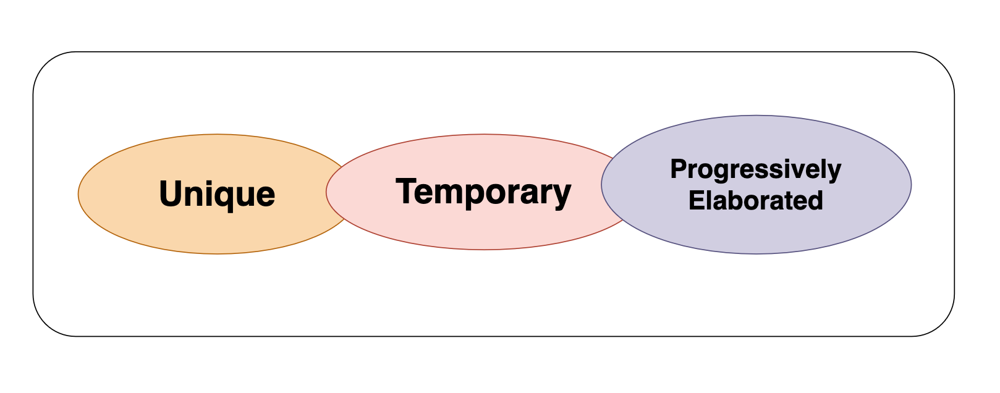
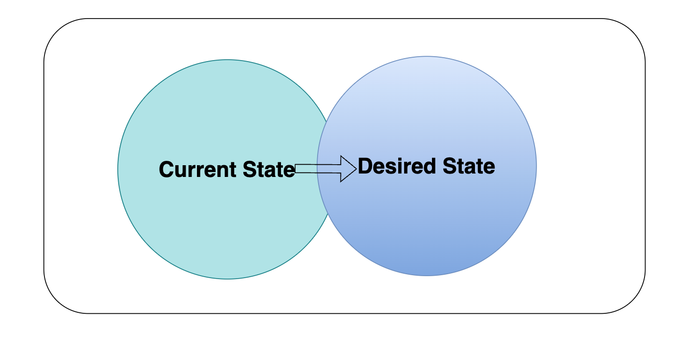

# Project Management Terms

### What is a project?
- A temporary endeavor that produceses a unique product service or result.
- Temporary in nature and has a definite beginning and ending. 
- Can be part of large Program or Portfolio. 

### What is Project Management?

Project managment is the application of knowledge, skills, tools, and techniques to satisfy project requirements. 
- Preparing a bisness case to justify the investment. 
- Estimating resources and times.
- Developing and implementing a management plan for the project. 
- Leading and motivating the project delivery team. 
- Managing the risks, issues, and changes on the project.
- Monitoring progress against plan. 
- Closing the project in a controlled fashion when appropriate. 

### What is Program Management? 

Group of related projects managed in a coordinate way to obtain benifits and controll not available from managing them indicidually.
- Must be some value added in managing them togather as a program. 
- A project may or may not be part of a program but a program will always have projects. 
- Focuses on the project interdependencies and helps to determine the optimal approach for managing them. 

### What is Project Management Office (PMP)?
Organizational structure that standardizes the processes and fascilitate the sharing of resources, methodologies, tools and techniques. 

Types: 
- **Supprotive:** Supports the project manager, such as providing templates, training or lessons learned from other projects.
- **Controlling:** Determines of framework or methodologies and use of specific forms. 
- **Directive:** Controls the project PM will be assigned and report to the PMO.

### What is Portfolio Management?

Portfolio managment is a collection of projects, program, subsidiary, portfolios and operations managed as a group to achieve objectives. 
- Collections of projects, programs, subsidiarity portfolios.
- Achieve strategic (long term) objectives.

### What is Operation Management? 
Operation Management is a field of management that focuses on the efficient and effective processes involved in the production and delivery of goods and services. It involves planning, organizing, and supervising production and manufacturing processes to ensure that an organization operates smoothly and meets its goals.
- Deals with the ongoing production of goods and/or services. 
- Considers the aquisition, development, and utilization of resources that firms need to deliver the goods and services. 

### What is the value of the Project?
- What value will this project bring to the company upon completion?
- Why should we undertake this project?
- Money, Brand Reputation, Customer Service, New or Change Product or Services. 

### Project enable changes
- Project can be vehicle for change in an organization.
- Takes a compnay from a current state to desired state. 

### Phases and Deliverables 
- **A phase is a collection of logically related project activities that culminates in the completion of one or more deliverables**. 
   - The number of the phases depends on the industry tupe and size and the complexity of the project. 
- **A deliverable is any unique and verifiable product, service or result.** 
   - May be tangible or intangible 
   - Must be accepted by the customer or sponsor for the phase. 

### Project Life Cycle 
- A representation of the phase that a project typically goes through from start to end.
Can be either predictive or adaptive.

### Project Givernance 
 - Framework within which project decisions are made. 
 - Three Pillars:
   - Structure: Kind of development structure.
   - People: People management 
   - Information: Collect the accurate information to make decision. 

### Stakeholders
- Individuals, group or organization that may affect, be affected or perceive to be affected by the prokect.

**Key Stakeholders**
- **Project Manager** - manages the project
- **Customer** - uses the project deliverable
- **Project team** - the collection of individuals completing the project work. 
- **Project Sponsor** - provides resources and support
- **Functional Manager** - Departmental Manager, i.e Manager of Engineering, Vice President of Marketing, Director of IT. Generally controls resources. 

### Project Manager Role 
- **Initiator:** An initiator is someone who takes the first step or proposes an idea or action.
- **Negotiator:** A negotiator is an individual who engages in discussions or formal negotiations to reach mutually agreeable solutions or outcomes. 
- **Listener:** A listener is someone who pays attention to others ideas, thoughts, or concerns during conversations or discussions. 
- **Coach:** A coach is a person who guides and supports individuals or teams in achieving their goals, improving performance and enhancing their skills. 
- **Working Memeber:** A working member refers to an individual who actively participates as a member of a team or group. 
- **Facilitator:** A facilitator is someone who manages group processes, discussions, or meetings to ensure effective communication, collaboration and decision-making. 

### Milestone vs Task Duration

**Milestone:**
- A significant point or event in a project.
- Marks the completion of a major phase or deliverable.
- Has zero duration as it represents a point in time.
- Used to track progress and ensure the project is on schedule.

**Task Duration:**
- The amount of time required to complete a specific task or activity.
- Measured in units of time (e.g., hours, days, weeks).
- Contributes to the overall timeline of the project.
- Can be estimated based on resources, complexity, and dependencies.

### Project Management Office 
- **Organizational Structure that standardizes the processes and facilitates the sharing of resources, methodologies, tools, and techniques.**
- **Types:**
   - **Supportive:** Supports the project manager, such as providing templates, training or lessons learned form other projects.
   - **Controlling:** Determines the framework or methodology and use of specific forms. 
   - **Directive:** Controls the project. PM will be assigned and report to the PMO. 

### Project Bosses
- **Sponsor**
  - Internal or External
  - Proejct Champio 
  - Funding the project 
  - Maybe used to resolve conflicts in the project.
- **Program Manager**
  - Senior to Project Manager
  - Maybe responsible for several projects executing at the same time. 
  - Maybe used to resolve conflicts in the project. 

### Organizational Structures 
- **Functional Organizations:** Structure that groups staff members according to their area of expertise (sales, marketing, construction, etc). Functional structures require the project team members to report directly to the functional manager. 
- **Matrix Organizations:** There are three matrix structures: **Week**, **Balanced**, and **Strong**. The different structures are reflective of the project manager's authority in relation to the functional manager's authority. 
- **Project oriented organizations, (Projectized):** Structure where the PM has the greatest amount of authority. The project team is assigned to the project on a full0time basis. When the project is complete, the project team members moves on the other assignments within the organization. 

- **Hybrid:** Blended type

### Organizational Structures Chart 

<table>
  <thead style="background-color:blue">
    <tr>
      <th>SL</th>
      <th>Funcational</th>
      <th>Weak Matrix</th>
      <th>Balance Matrix </th>
      <th>Strong Matrix </th>
      <th>Projectized</th>
    </tr>
  </thead>
  <tbody>
    <tr style="background-color:#3498db">
      <td style="background-color:blue">PM</td>
      <td>Little/No</td>
      <td>Low</td>
      <td>Low to Moderate</td>
      <td>Moderate to High</td>
      <td>High/Total</td>
    </tr>
    <tr style="background-color:#6495ED">
      <td style="background-color:blue">Resource Avail.</td>
      <td>Little/No</td>
      <td>Low</td>
      <td>Low to Moderate</td>
      <td>Moderate to High</td>
      <td>High/Total</td>
    </tr>
    <tr style="background-color:#3498db">
      <td style="background-color:blue">Budget Controls</td>
      <td>Functional Manager</td>
      <td>Functinal manager</td>
      <td>Mixed</td>
      <td>PM</td>
      <td>PM</td>
    </tr>
    <tr style="background-color:#6495ED">
      <td style="background-color:blue">PM Role</td>
      <td>PT</td>
      <td>PT</td>
      <td>PT/FT</td>
      <td>FT</td>
      <td>FT</td>
    </tr>
    <tr style="background-color:#3498db">
      <td style="background-color:blue">PM Staff</td>
      <td>PT</td>
      <td>PT</td>
      <td>PT/FT</td>
      <td>FT</td>
      <td>FT</td>
    </tr>
  </tbody>
</table>

### Areas of a project
- **Scope** Work to be done
- **Schedule** Time to get the work done 
- **Cost** Budget of the work 
- **Quality** Customer satisfaction of work 
- **Resources** Managing the people and material resources
- **Communications:** All stakeholders get the correct information at the right time. 
- **Risk** Identifying and responding to risk over the lifecycle of the project
- **Procurements:** Acquiring resources from outside the project team 
- **Stakeholder's engagement:** Keeping all stakeholders active and alert on the project. 

### Project Management Approaches
- Two primary approaches: predictive (also know as traditional or waterfall) and adaptive (also known as agile or iterative).
- **Predictive Approach:** The predictive approach follows a linear and sequential process. 
  - It involves detailed planning and documentation upfront, with a focus on predicting and defining the project scope, objectives, timeline and deliverables.
  - Extensive upfront planning 
  - Sequential execution 
  - Emphasis on control and documentation
  - Limited flexibility, limited changes with a well define change control process. 

- **Adaptive Approach:** The **Adaptive Approach** focuses on flexibility, collaboration and iterative development. 
  - It embraces change throughout the project and emphasizes continuous feedback and improvement. 
  - Iterative and incremental development.
  - Customer collaboration 
  - Emphasis on adaptability 
  - Self-organizing teams 
  - The adaptive approach, commonly used in agile methodologies like Scrum or Kanban. 

### Product vs Project Management 
### **Product Management**
- Product management encompassess the strategic planning, development, and lifecycle management of a product or service. 
- It involves understanding market needs, defining product strategy, gathering requirements, and overseeing the product's development, launch and onging optimization.
- Product managers are responsible for the overall success of the product, aligning it with business objectives and customer demands. 

### **Project Management**
- Focuses on the successful execution and delivery of specific projects within a defined scope, timeline and budget. 
- Project managers are responsible for planning, coordinating, and managing the activities required to achieve project goals. 
- They ensure the project is completed on time, within budget, and according to the specified quality standards. 

### Product vs Project Management 
- Product managers work closely with project managers to translate the product strategy and roadmap into actionable project plans.
- Project managers oversee the execution of those plans, ensuring that the product is developed, tested, and delivered according to the defined specifications. 
- While project management is a part of product development, it is just one component. 

### Issues, risksm assumptions, and constraints.
- **Risks:** Risks are potential events or situations that may occur in the future and have an impact on the project's success. 
- **Issues:** Issues refer to problems or challenges that arise during the course of a project. They are typically negative events or circumstances that can hinder progress or impact project objectives. 
- **Assumptions:** Assumptions are statements or beliefs that are considered to be true or valid for the purpose of planning and decision-making. 
- **Constraints:** Constraints are limitations or restrictions that affect project planning and execution. 

### Leadership vs. Management
**Management**
- Management focuses on tasks, prpcesses and operations to ensure efficient execution.
- It involves planning, organizing, coordinating, and controlling resources. 
- Managers have formal authority and responsibility within the organization.
- They maintain stability, control and order, ensuring established processes and procedures are followed. 
- Focus on cooordinating and directing tasks, resources, and processes to achieve predetermined objectives.
- Ensure that work is completed efficiently.
- Management often focuses on immediate goals and operational efficiency. 
- Management aims to maintain stability, implementing processes and procedires that minimize risks.
- Managers focus on achieving efficiency and optimizing resources. 

**Leadership:**
- Focuses on inspiring and influencing others.
Involves setting direction, motivating and empowering individuals. 
- Involves setting direction, motivating and empowering individuals.
- They inspire and influence others. 
- They encourage collaboratio, trust and empowerment. 

###  Management vs Leadership 
<table>
  <thead style="background-color:blue">
    <tr>
      <th>Management</th>
      <th>Leadership</th>
    </tr>
  </thead>
  <tbody>
    <tr style="background-color:#3498db">
      <td>Direct using positional power</td>
      <td>Guide, influence and collaborate using relational power</td>
    </tr>
    <tr style="background-color:#6495ED">
      <td>Maintain</td>
      <td>Develop</td>
    </tr>
    <tr style="background-color:#6495ED">
      <td>Administrate</td>
      <td>Innovate</td>
    </tr>
    <tr style="background-color:#3498db">
      <td>Focus on systems and structure</td>
      <td>Focus on relationships with people</td>
    </tr>
    <tr style="background-color:#6495ED">
      <td>Rely on control</td>
      <td>Inspire trust</td>
    </tr>
    <tr style="background-color:#3498db">
      <td>Focus on near-term goals</td>
      <td>Focus on long-range vision</td>
    </tr>
    <tr style="background-color:#6495ED">
      <td>Ask how and when</td>
      <td>Ask what and why</td>
    </tr>
    <tr style="background-color:#3498db">
      <td>Focus on bottom line</td>
      <td>Focus on the horizon</td>
    </tr>
    <tr style="background-color:#6495ED">
      <td>Accept status quo</td>
      <td>Challenge status qua</td>
    </tr>
    <tr style="background-color:#3498db">
      <td>Do things right</td>
      <td>Do the right things</td>
    </tr>
    <tr style="background-color:#6495ED">
      <td>Focus on operational issues and problem solving</td>
      <td>Focus on vision, alignment, motivation and inspiration</td>
    </tr>
  </tbody>
</table>

### Emotional Intelligence 
- Emotional Intelligence (EQ) refers to the ability to recognize, understand and manage emotions, both in oneself and in others. 
- It involves being aware of one's own emotions, effectively handling them, empathizing with others, and using emotions to guide thinking and behavior. 
- In project management, EQ plays a significant role. 

### Importance of Emotional Intelligence in Project Management

Emotional Intelligence (EQ) is crucial for project managers as it enhances their ability to lead teams, manage stress, and navigate complex interpersonal dynamics. Here are some key aspects:

- **Self-awareness:** Understanding one's own emotions, strengths, and weaknesses helps project managers make informed decisions and maintain composure under pressure.
- **Self-regulation:** The ability to control or redirect disruptive emotions and impulses ensures that project managers can handle conflicts and challenges calmly and effectively.
- **Motivation:** A strong internal drive to achieve goals and maintain a positive attitude can inspire and motivate the project team.
- **Empathy:** Recognizing and understanding the emotions of team members fosters a supportive and collaborative environment, leading to better team cohesion and performance.
- **Social skills:** Effective communication, conflict resolution, and relationship-building skills are essential for managing stakeholder expectations and ensuring project success.

By leveraging emotional intelligence, project managers can create a positive work environment, improve team dynamics, and increase the likelihood of project success.

